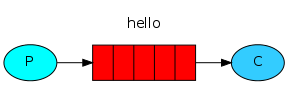

# RabbitMQ Tutorial - Hello World!

이 튜토리얼에서는 파이썬으로 2개의 작은 프로그램을 작성할 것입니다. producer(sender)는 단일 메시지를 보내고 consumer(receiver)는 메시지를 받고 그것을 출력합니다. 그 메시지는 "Hello World"입니다.

아래 이미지를 보면 "P"는 producer, "C"는 consumer. 중간의 박스는 queue(RabbitMQ가 consumer를 대신하여 보관하는 메시지 버퍼)입니다.



Producer는 "hello"라는 메시지를 큐(queue)에 전송하고 consumer는 큐로부터 메시지를 받습니다.

### RabbitMQ libraries

RabbitMQ는 여러 프로토콜을 사용합니다. 이 튜토리얼에서는 메시징을 위한 개방형 범용 프로토콜인 AMQP 0-9-1을 사용합니다. 다양한 언어로 된 RabbitMQ 클라이언트가 많이 있습니다. 여기서는 RabbitMQ 팀에서 권장하는 파이썬 클라이언트인 Pika 1.0.0 를 사용할 것입니다. 설치하려면 pip 패키지 관리 도구를 사용할 수 있습니다.

```shell
python -m pip install pika --upgrade
```

<br>
<br>

## 보내기(Sending)

우리의 첫번째 프로그램은 send.py가 큐에 단일 메시지를 보낼 것입니다. 먼저 해야 할 일은 RabbitMQ 서버와 연결을 설정하는 것입니다.

```python
#!/usr/bin/env python
import pika

connection = pika.BlockingConnection(pika.ConnectionParameters('localhost'))
channel = connection.channel()
```

이제 로컬 브로커에 연결되었습니다. 다른 브로커에 연결하려면 여기(localhost)에 이름이나 IP주소를 지정하면 됩니다.

다음으로 메시지를 보내기 전에 받는 큐가 존재하는지 확인해야 합니다. 존재하지 않는 위치에 메시지를 보내면 RabbitMQ는 메시지를 삭제합니다. 메시지가 전달될 Hello 큐를 생성해 봅시다.

```python
channel.queue_declare(queue='hello')
```

이 시점에서 우리는 메시지를 보낼 준비가 되었습니다. 첫 번째 메시지에는 Hello World!라는 문자열만 포함됩니다. 그리고 우리는 그것을 우리의 hello 큐로 보내고 싶습니다.

RabbitMQ에서 메시지는 큐로 직접 보낼 수 없으며 항상 교환을 거쳐야 합니다.(그러나 세부 사항에 연연하지 말자. 이 튜토리얼의 세 번째 부분에서 교환에 대해 자세히 알 수 있습니다.) 이제 우리가 알아야 할 것은 빈 문자열로 식별되는 기본 교환을 사용하는 방법뿐입니다. 이 교환은 특별합니다.(메시지를 보내야 하는 큐를 정확히 지정할 수 있습니다.) routing_key 매개변수에 대기열 이름을 지정해야 합니다.

```python
channel.basic_publish(exchange='',
                      routing_key='hello',
                      body='Hello World!')
print(" [x] Sent 'Hello World!'")
```

프로그램을 종료하기 전에 네트워크 버퍼가 플러시되고 메시지가 실제로 RabbitMQ에 전달되었는지 확인해야 합니다.

```python
connection.close()
```

**Sending doesn't work!**

RabbitMQ를 처음 사용하고 "Sent" 메시지를 표시되지 않으면 브로커가 충분한 여유 디스크 공간 없이 시작되어(기본적으로 최소 200MB의 여유 공간이 필요) 메시지 수락을 거부하고 있을 수 있습니다. 브로커 로그 파일을 확인하여 필요한 경우 제한을 확인하고 줄이십시오. 구성 파일 문서에서 disk_free_limit를 설정하는 방법을 확인해보세요.

<br>
<br>

## 받기(Receiving)

우리의 두번째 프로그램 receive.py는 큐로부터 메시지를 받고 그것을 화면에 출력할 것입니다.

다시, 먼저 RabbitMQ 서버에 연결해야 합니다. Rabbit에 연결하는 코드는 이전과 동일합니다.

다음 단계는 이전과 마찬가지로 큐가 존재하는지 확인하는 것입니다. queue_declare를 사용해 큐를 만드는 것은 멱등적(동일한 명령을 여러번 실행할 수 있으며 하나만 생성됩니다)입니다.

```python
channel.queue_declare(queue='hello')
```

여기서 큐를 다시 선언하는 이유를 궁금해할 수 있습니다. 예를 들어 send.py 프로그램이 이전에 실행된 경우. 그러나 어떤 프로그램을 먼저 실행할지 아직 확실하지 않습니다. 이러한 경우 두 프로그램에서 큐 선언을 반복하는 것이 좋습니다.

<br>

**Listing queues**

RabbitMQ에 있는 큐와 그 안에 있는 메시지 수를 보고 싶을 수 있습니다. Rabbitmqctl 도구를 사용하여 권한 있는 사용자로 수행할 수 있습니다.

```shell
sudo rabbitmqctl list_queues
```

Windows에서는 sudo를 생략합니다.

```command
rabbitmqctl.bat list_queues
```

큐에서 메시지를 받는 것은 더 복잡합니다. 콜백 함수를 큐에 등록하여 작동합니다. 메시지를 받을 때마다 이 콜백 함수는 Pika 라이브러리에서 호출됩니다. 우리의 경우 이 함수는 메시지 내용을 화면에 출력합니다.

```python
def callback(ch, method, properties, body):
    print(" [x] Received %r" % body)
```

다음으로, 이 특정 콜백 함수가 Hello 큐에서 메시지를 수신해야 한다고 RabbitMQ에 알려야 합니다.

```python
channel.basic_consume(queue='hello',
                      auto_ack=True,
                      on_message_callback=callback)
```

해당 명령이 성공하려면 'hello' 큐가 존재하는지 확인해야 합니다. 다행히 queue_declare를 사용하여 위에서 큐를 생성했습니다.

마지막으로 데이터를 기다리고 필요할 때마다 콜백을 실행하고 프로그램 종료 중에 KeyboardInterrupt를 잡는 끝없는 루프에 들어갑니다.

```python
print(' [*] Waiting for messages. To exit press CTRL+C')
channel.start_consuming()
```

```python
if __name__ == '__main__':
    try:
        main()
    except KeyboardInterrupt:
        print('Interrupted')
        try:
            sys.exit(0)
        except SystemExit:
            os._exit(0)
```

<br>
<br>

## Putting it all together

**send.py**

```python
#!/usr/bin/env python
import pika

connection = pika.BlockingConnection(
    pika.ConnectionParameters(host='localhost'))
channel = connection.channel()

channel.queue_declare(queue='hello')

channel.basic_publish(exchange='', routing_key='hello', body='Hello World!')
print(" [x] Sent 'Hello World!'")
connection.close()
```

**receive.py**

```python
#!/usr/bin/env python
import pika, sys, os

def main():
    connection = pika.BlockingConnection(pika.ConnectionParameters(host='localhost'))
    channel = connection.channel()

    channel.queue_declare(queue='hello')

    def callback(ch, method, properties, body):
        print(" [x] Received %r" % body)

    channel.basic_consume(queue='hello', on_message_callback=callback, auto_ack=True)

    print(' [*] Waiting for messages. To exit press CTRL+C')
    channel.start_consuming()

if __name__ == '__main__':
    try:
        main()
    except KeyboardInterrupt:
        print('Interrupted')
        try:
            sys.exit(0)
        except SystemExit:
            os._exit(0)
```

이제 터미널에서 프로그램을 사용해 볼 수 있습니다. 먼저, 배송을 기다리는 동안 지속적으로 실행되는 consumer를 시작하겠습니다.

```shell
python receive.py
# => [*] Waiting for messages. To exit press CTRL+C
```

이제 새 터미널에서 producer를 시작합니다. producer 프로그램은 모든 실행 후에 중지됩니다.

```shell
python send.py
# => [x] Sent 'Hello World!'
```

consumer는 다음 메시지를 출력합니다.

```shell
# => [*] Waiting for messages. To exit press CTRL+C
# => [x] Received 'Hello World!'
```

RabbitMQ를 통해서 첫 번째 메시지를 보냈고 receive.py 프로그램은 종료되지 않습니다. 추가 메시지를 수신할 준비가 된 상태로 유지되며 Ctrl-C로 중단될 수 있습니다.